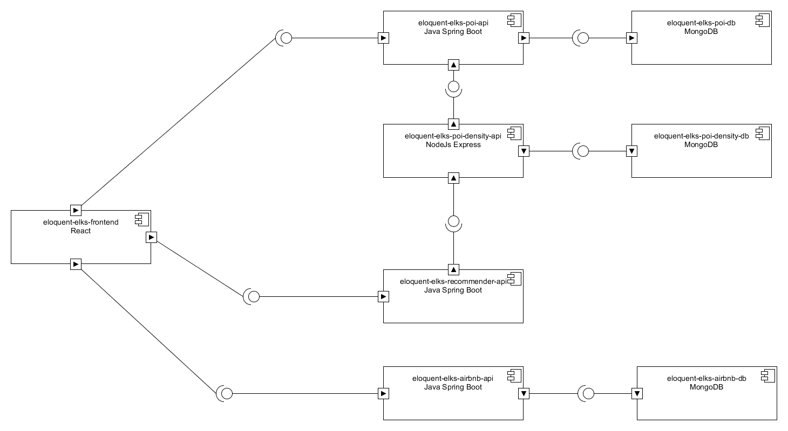
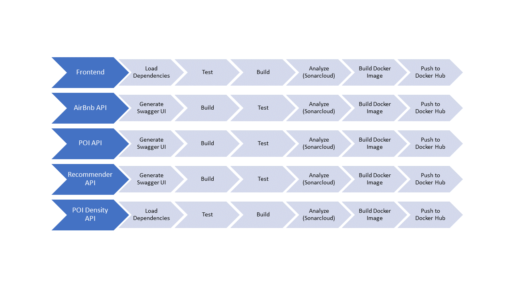
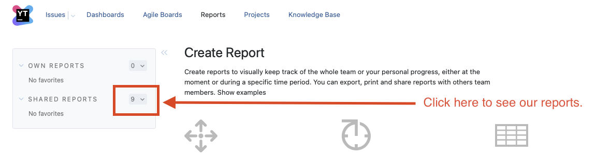

# EloquentElks - New York City Tourism Recommender 
## Introduction
Traveling to New York is a dream for many people. However, planning the trip such that one has the best possible experience in New York can be difficult. Finding the right place to stay is often the first but most challenging task when planning a trip. In NYC, there are just too many options. Therefore, we created a tool where users can enter their budget and their preferences for the city trip, and we recommend an area to look for an apartment as well as interesting activities to do in the city.

## Code Metrics
For a current snapshot of our code quality metrics, please refer to the links below:
| Component | Quality |
|--|--|
| Frontend |   |
| AirBnb API |   |
| POI API |    |
| Recommender API |   |
| POI Density API |    |

## Quick Start

The easiest way to get the application up and running is to use our docker-compose.yml, which uses our [Docker Hub Images](https://hub.docker.com/search?q=niels89%2Feloquent-elks&type=image)

All you need in order to get started is our [docker-compose.yml](./docker-compose.yml), as well as the [db_folder_setup.sh](./db_folder_setup.sh) script. 

After downloading these two files, put them into an empty folder of your choice and open a command line in the same folder.

First execute `bash db_folder_setup.sh`

To get the application started, run the following command:
`docker compose -f docker-compose.yml up -d`

Afterwards, open your browser and go to `http://localhost:3000` to access the application.

To stop the entire application, run the following command:
`docker compose -f docker-compose.yml down`

If you decide to re-run docker compose up at a later point, remember to rerun `bash db_folder_setup.sh`

This ensures that the database folders are cleared, so you can start over with fresh databases.

## Development
### Prerequisites
In order to be able to build all of the services, you need the following tools and environments installed on your machine:

 - [Java](https://openjdk.java.net/) (OpenJDK 11 or newer)
 - [Gradle](https://gradle.org/)
 - [Yarn](https://yarnpkg.com/) 
 - [Npm](https://yarnpkg.com/)
 - [Docker](https://www.docker.com/)
 - [Docker Compose](https://docs.docker.com/compose/) 

### How to get started
To build the entire application including all microservices, run the following command in the root directory of the project: `bash ./build_docker_containers.sh`. This builds all the projects and sets up the docker containers. For details on the individual microservices, please refer to the following pages:

 - Frontend: [README](./eloquent-elks-frontend/README.md)
 - Airbnb API: [README](./eloquent-elks-airbnb-api/README.md)
 - POI API: [README](./eloquent-elks-poi-api/README.md)
 - Recommender API: [README](./eloquent-elks-recommender-api/README.md)
 - POI Density API: [README](./eloquent-elks-poi-density-api/README.md)

Each eloquent-elks database has its own seeding docker image. We found this to be the most stable way of initially loading data into a mongodb docker container. DB-Seeds are available for the following databases:

 - eloquent-elks-airbnb-db: [README](./eloquent-elks-airbnb-db/README.md)
 - eloquent-elks-poi-db: [README](./eloquent-elks-poi-db/README.md)
 - eloquent-elks-poi-density-db: [README](./eloquent-elks-poi-density-db/README.md)

### Architecture
This application consists of various microservices. Each of them runs in a docker container, which enables easy deployment on cloud platforms. As of now, the application consists of the following microservices:
#### eloquent-elks-frontend
The frontend is written in [React](https://reactjs.org/). It uses [grommet](https://v2.grommet.io/) and [leaflet](https://leafletjs.com/) for the visualizations.
#### eloquent-elks-airbnb-api
 The AirBnb API is based on [Java Spring Boot](https://spring.io/projects/spring-boot). It connects to the eloquent-elks-airbnb-db and exposes the AirBnb data to the frontend.
#### eloquent-elks-airbnb-db
The AirBnb database is a [MongoDB](https://www.mongodb.com) containing data on AirBnbs. The data has been retrieved from [Kaggle](https://www.kaggle.com/dgomonov/new-york-city-airbnb-open-data).
#### eloquent-elks-poi-api
The POI API is based on [Java Spring Boot](https://spring.io/projects/spring-boot). It connects to the eloquent-elks-poi-db. It is responsible for exposing the Points of Interest of New York to the frontend, and also to the POI Density API.
#### eloquent-elks-poi-db
The POI database is a [MongoDB](https://www.mongodb.com) containing data on the Points of Interest of New York. The data has been collected from [OpenStreetMap](https://www.openstreetmap.org).
#### eloquent-elks-poi-density-api
The POI Density API is implemented in [NodeJS Express](https://expressjs.com). Its job is to calculate the density of various types of attractions and is called by the Recommender API. In turns, it gets the POIs from the POI API. For the density calculation, it uses the [TurfJS](https://turfjs.org/) library.
#### eloquent-elks-poi-density-db
The POI Density database is a [MongoDB](https://www.mongodb.com) acting as a cache for the POI Density API, such that it does not have to recompute the density layers if they did not change.
#### eloquent-elks-recommender-api
The Recommender API is written in [Java Spring Boot](https://spring.io/projects/spring-boot). It is responsible for retrieving the density calculations from the POI Density API and processing these results. In particular, this involves normalization and aggregation.

## Testing
For each microservice, we wrote unit tests during the development. For the Java Spring Boot applications, we tested with [JUnit](https://junit.org/junit5/) and for the Javascript-based applications, we tested with [Jest](https://jestjs.io/).

Here is how you can run the tests of each microservice, assuming your current working directory is the EloquentElks root folder:

 - Frontend: `yarn --cwd ./eloquent-elks-frontend test`
 - AirBnb API: `./eloquent-elks-airbnb-api/gradlew -p ./eloquent-elks-airbnb-api test`
 - POI API: `./eloquent-elks-poi-api/gradlew -p ./eloquent-elks-poi-api test`
 - Recommender API: `./eloquent-elks-recommender-api/gradlew -p ./eloquent-elks-recommender-api test`
 - POI Density API: `npm test --prefix ./eloquent-elks-poi-density-api`

The coverages of each microservice is available in the [Code Metrics](#code-metrics) section.

For the frontend, we focused also on manual user acceptance testing, as it yields invaluable feedback regarding the usability of the application. Also, the frontend served for manual intergration testing, as it allows to call the microservices and verify if they work together properly.

## Continuous Integration

For continuous integration, we use [Travis CI](https://travis-ci.com/). In order to build our microservice efficiently, we set up a build pipeline that consist of 5 build jobs, one for each API microservice.

For quality checks, we use Sonarcloud's Quality Gates, which are displayed at the top of this page. If a Pull Request is opened, Sonarcloud will provide the Quality Gate evaluation results automatically as comments. This is a very helpful tool to keep code quality on a good level. 

The build job of each microservice takes care of building the respective database and database seed images, and pushes them to docker hub as well.

## Other Resources
If you are interested in our working procedures, check out our [YouTrack KANBAN board](https://aseii-eloquentelks.myjetbrains.com/youtrack/agiles) (requires a user account).

The rationale behind our choices and decisions is available in our [YouTrack Knowledge Base (Wiki)](https://aseii-eloquentelks.myjetbrains.com/youtrack/articles/) (requires a user account).

Gantt charts for the stories and for the whole project are available at [YouTrack Reports](https://aseii-eloquentelks.myjetbrains.com/youtrack/reports) (requires a user account):

