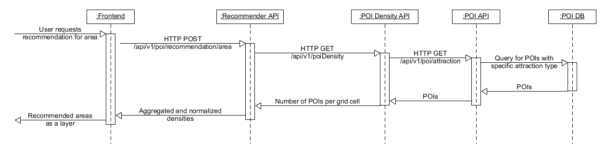

# EloquentElks - Recommender API
The Recommender API is responsible for providing a variety of recommendations to the frontend. As of now, it is capable of recommending an area to look for accommodation when provided with a list of attraction types for POIs.

## Documentation

### Swagger UI
This API is documented with Swagger UI. To access it, run the service (i.e. as a docker container using the script provided in the root directory) and access http://localhost:1338/docs/ui/index.html. The documentation is regenerated every time the `build_docker_containers.sh` script is executed. If you use [Docker Hub Images](https://hub.docker.com/repository/docker/niels89/eloquent-elks-recommender-api), Swagger UI is already included.

### Javadoc
For source code documentation, please refer to our [Javadocs](https://niels89.github.io/EloquentElks/eloquent-elks-recommender-api/javadoc/index.html)

## How does it work?
We decided to make area recommendations according to the following schema (also depicted below):

1.  The [Frontend](../eloquent-elks-frontend/README.md) calls recommender API with HTTP Post containing the attraction types that the user is interested in
2.  The Recommender requests the density calculation from the POI density calculation endpoint.
3.  The [POI density API](../eloquent-elks-poi-density-api/README.md) looks in the database if a recommendation for these areas have already been made and returns them if available.
4. 	For all the attraction types that are not in the database, the [POI density API](../eloquent-elks-poi-density-api/README.md) requests the POI of the respective type from the [POI API](../eloquent-elks-poi-api/README.md).
5.  With the received POIs, the POI density service structures the data into a hexagonal grid and counts the number of POIs in each grid cell. It assigns an ID to each grid cell, so that the recommender can normalize and aggregate the different attraction type densities.
6.  When the recommender receives the density calculation results, it normalizes them and stores them into the database.
7.  After normalization, the data is combined in to one aggregate density grid containing all the attraction types.
8.  The result is returned to the frontend, where the density is displayed on the map as circles with color-coded intensities.

The reason for this process is that it separates concerns of the different microservices. We get coherent services that are easy to maintain and understand.

